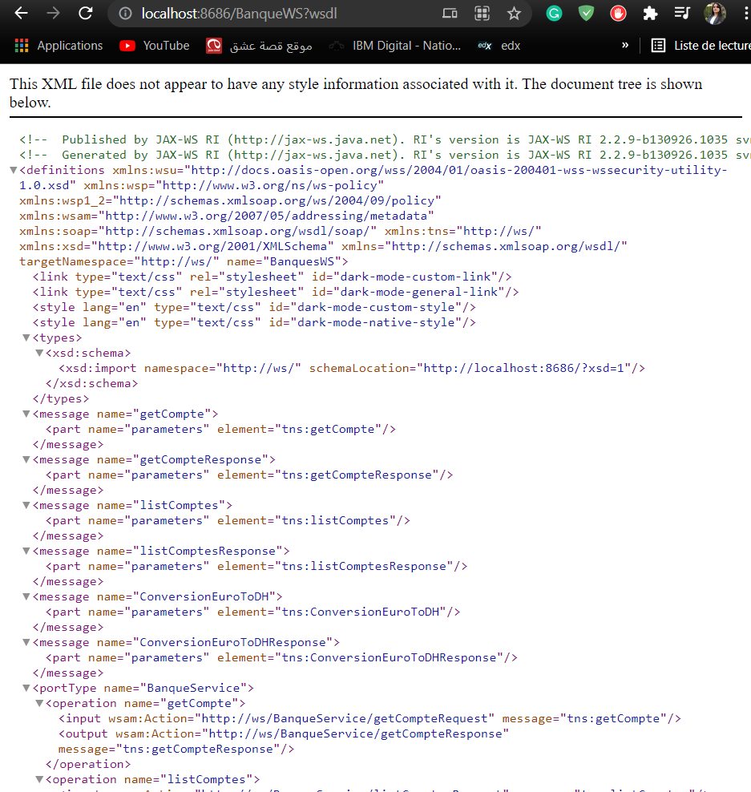
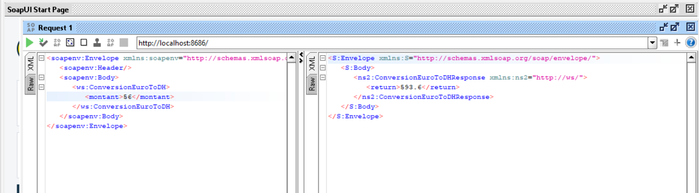

#Welcome to JEE Labs 2021/2022

_In this repository you can find all the labs that we've done this semester_ 

##LAB 1

###In this lab we have to:
####Create a SOAP web service based on **JaxWS** that allows us to: 
1. Convert an amount from Euro to DH
2. View an account
3. View a list of accounts

####Analyze the WSDL in  the Browser

_Link: http://localhost:8686/BanqueWS?wsdl_

####Test the Web Service with SoapUI
 _Testing conversion from Euro To DH_

